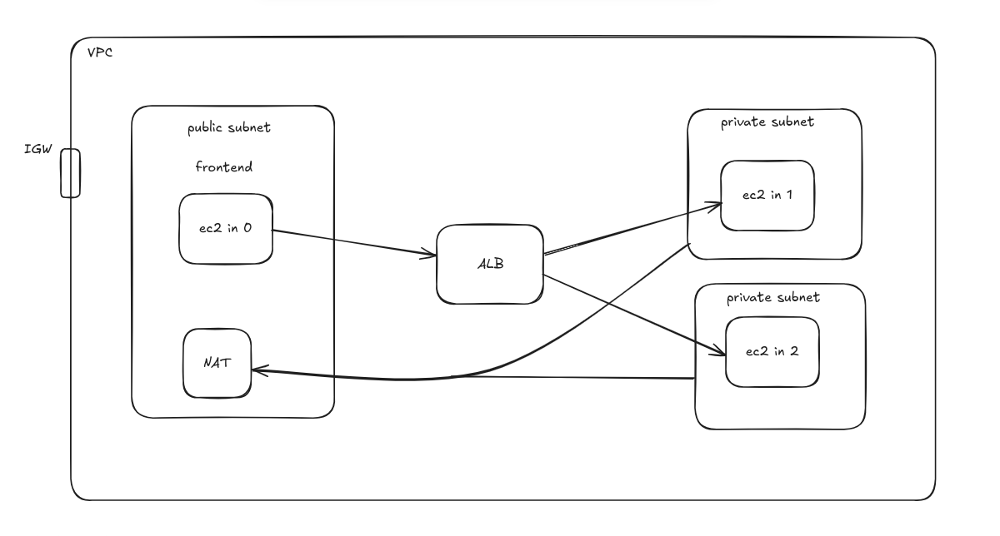

# Amazon Application Load Balancing of Todo Project

This project defines a scalable and secure AWS architecture using Pulumi. This project includes:

- A VPC with public and private subnets.
- Published docker images to Dockerhub.
- Frontend EC2 instance in the public subnet.
- Backend EC2 instances in private subnets with a NAT Gateway for outbound internet access.
- An Application Load Balancer (ALB) for traffic distribution.



# Architecture Overview

## Components:

1. **VPC:** Contains public and private subnets.
2. **NAT Gateway:** Provides internet access to private instances.
3. **Frontend (Public Subnet):** Hosts the frontend EC2 instance. Pull the docker image from dockerhub.
4. **Backend (Private Subnet):** Hosts backend EC2 instances. Pull the docker image from dockerhub.
5. **ALB (Application Load Balancer):** Distributes traffic between backend instances.

# Setup Instructions

## Prerequisites

1. **AWS Account:** Ensure you have an active AWS account.
2. **Pulumi CLI:** Install Pulumi from Pulumi's official site.
3. **AWS CLI:** Install AWS CLI and configure it with your Access Key and Secret Key

```
aws configure
```

# Installation

## Step 1: Install Dependencies

1. Clone the repository:
2. Change directory to alb-load-blancing-of-todo-project by running

   ```
   git clone https://github.com/BarunBlog/alb-load-blancing-of-todo-project
   cd alb-load-blancing-of-todo-project/infra
   ```

3. Create and Activate the virtual environment.

   - For linux

     ```
     python3 -m venv myvenv
     source myvenv/bin/activate

     ```

   - For Windows
     ```
     python -m venv myvenv
     myvenv\Scripts\activate
     ```

## Step 2: Set Up Pulumi Project

Initialize the Pulumi project:

```
pulumi login
pulumi stack init dev
```

Set the required AWS region (e.g., ap-southeast-1):

```
pulumi config set aws:region ap-southeast-1
```

Generate Key pair file:

```
make key-pair
```

## Step 3: Deploy the Architecture

Run the Pulumi up command to create all AWS resources:

```
pulumi up
```

## Step 4: Access Your Resources

1. Frontend Instance:

   - After deployment, fetch the public IP of the frontend instance from the Pulumi output or AWS Console.
   - Access it using SSH:

   ```
   ssh -i <your-key.pem> ubuntu@<frontend-instance-public-ip>

   ```

   - Now we accessed into frontend instance. Now we need to copy the key pair file to our frontend instance.

   ```
    scp -i MyKeyPair.pem /path/to/local-file.pem ubuntu@<ec2-public-ip>:/path/to/destination/

    chmod 400 your-key.pem

   ```

2. Backend Instances:

   - Use a Bastion Host or SSH to connect via the frontend instance.
   - Ensure your private key is available on the frontend instance:

   ```
   ssh -i <your-key.pem> ubuntu@<backend-private-ip>

   ```

3. ALB:

   - Get the ALB DNS from Pulumi output or AWS Console.
   - cd to `frontend`. You need to add the ALB DNS link to the frontend `nginx.conf` file like following.

   ```
    proxy_pass http://internal-todo-app-alb-b70d17e-1045841717.ap-southeast-1.elb.amazonaws.com/;
   ```

   - Then build the image to deploy from you local computer to dockerhub.

   ```
   make all-frontend
   ```

4. Install docker and pull docker images:
   - You need to run `ec2_init_config.sh` file to all of the Ec2 instances to install docker.
   - Then run following commands to run docker images.
   - Frontend Command:
   ```
       sudo docker run -d -p 80:80 barun25/todo_react_frontend:latest
   ```
   - Backend Command:
   ```
   sudo docker run -d -p 8000:8000 barun25/todo_django_backend:latest
   ```

## Step 5: Visit the frontend site

- Now from the AWS console take public ip of frontend ec2 instance and visit
  `http://<publi-ip-of-front-instance>`

# Resources Created

1. VPC with public and private subnets
2. NAT Gateway
3. ALB with target groups for backend instances
4. EC2 instances in frontend and backend subnets
5. Security Groups for frontend, backend, and ALB
6. Docker setup on EC2 instances, pulling containers from DockerHub
